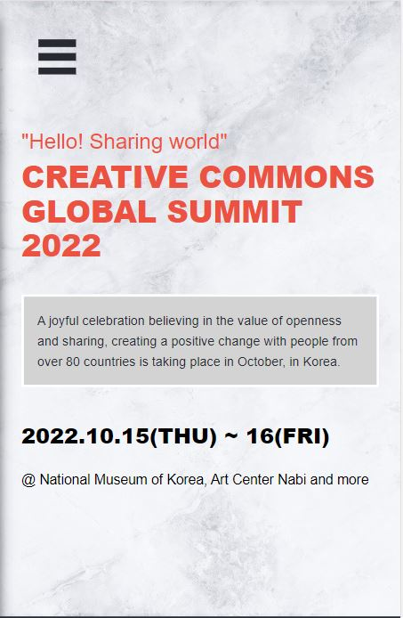
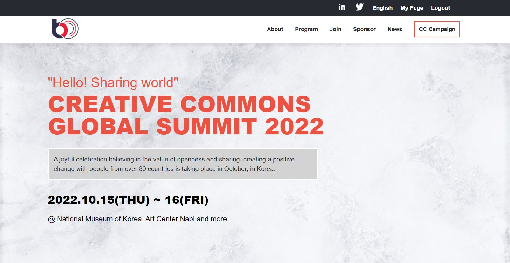

# Capstone Project

> A Website for the Creative Commons Global Summits 2022.

- .
- .
- [Video Demo](https://www.loom.com/share/1ec6e7d271844aaeb2c86ea3a5b27876)

## Built With

- HTML
- CSS
- JavaScript

## Live Demo

- [Capstone-Project](https://sediqullahbadakhsh.github.io/Capstone-project/).

## Getting Started

### Prerequisites

> Please Make sure to have upto date Browsers inorder to find the pages fully functional.

### Setup

> Inorder to setup the project, required to have a Hosting as well as Domain name.

### Install

> Please Download the entire Directory from [here](https://github.com/sediqullahbadakhsh/capstone-project/), and upload it on your Domain Cpanel.

### Usage

> It's a website describes everyear events held on behlaf of Creative Commons Global Summits.

## Authors

👤 **Sediqullah Badakhsh**

- GitHub: [@Badakhsh](https://github.com/sediqullahbadakhsh)
- Twitter: [@Badakhsh](https://twitter.com/sediqullah6)
- LinkedIn: [@Badakhsh](https://linkedin.com/in/sediqullah-badakhsh-999053a8)

## 🤝 Contributing

Contributions, issues, and feature requests are welcomed, [Here](https://github.com/sediqullahbadakhsh/Capstone-project/issues/).

## Show your support

Give a ⭐️ if you like this project!

## 📝 License

This project is [MIT](./MIT.md) licensed.

## Design Credits

- Design: [@Cindy Shin in Behance](https://www.behance.net/gallery/29845175/CC-Global-Summit-2015)
